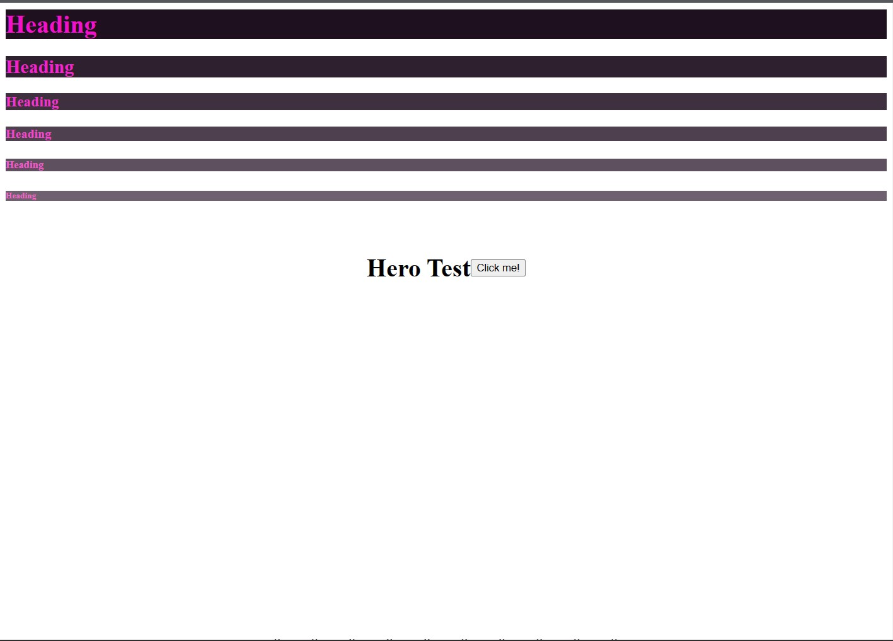

# Example

As of version `1.0.1-alpha.2`,
This is an example of of implimentation of the SolarisUI framework.

```ts
// Creating a project to compile the Source.
const project = new sui.SolarisUI("Test");
// Head of any page
const head = new sui.Head("Head");


// creating index page
const indexPage = new sui.Page("index.html");
indexPage.addChild(head);
indexPage.addChild(new sui.Body());

for (let i = 1; i <= 6; i++) {
    const heading =new sui.Heading(i, "Heading");
    heading.setStyles({
        color:`#f${i}${i}${i}cc`,
        "background-color": `#${i}f${i}0${i}f`
    })
    indexPage.body?.addChild(heading);
}

// Hero 
const hero = new sui.HorizontalAlignContainer(["20px"]);
hero.align("middle", "center");
hero.addChild(new sui.Heading(1, "Hero Test"));
hero.addChild(new sui.Button("Click me!"));


// Full height Container
const container = new sui.VerticalAlignContainer(["20px"]);
container.align("middle", "center");
container.fill("vertical");
for (let i = 0; i < 10; i++) {
    container.addChild(new sui.String(`Hello ${i}`) );
}

indexPage.body?.addChildren(hero,container);
project.build(indexPage);
```


Here is the (formatted) output.
```html
<html lang="en">

<head>
    <title>Head</title>
    <meta name="author" content="">
    </meta>
    <meta name="description" content="">
    </meta>
    <meta name="keywords" content="">
    </meta>
    <link rel="stylesheet" href="./style/index.css">
    </link>
</head>

<body>
    <h1 style="color: #f111cc; background-color: #1f101f;">Heading</h1>
    <h2 style="color: #f222cc; background-color: #2f202f;">Heading</h2>
    <h3 style="color: #f333cc; background-color: #3f303f;">Heading</h3>
    <h4 style="color: #f444cc; background-color: #4f404f;">Heading</h4>
    <h5 style="color: #f555cc; background-color: #5f505f;">Heading</h5>
    <h6 style="color: #f666cc; background-color: #6f606f;">Heading</h6>
    <div style="padding: 20px   ;display: flex; align-items: center; justify-content: center;"
        class="container horizontal-container">
        <h1>Hero Test</h1>
        <button>Click me!</button>
    </div>
    <div style="padding: 20px ;display: flex; align-items: center; justify-content: center;height: 100%; flex-grow: 1;"
        class="container vertical-container">Hello 0Hello 1Hello 2Hello 3Hello 4Hello 5Hello 6Hello 7Hello 8Hello 9
    </div>
</body>

</html>

```

```css
.container {
    display: flex;
    justify-content: flex-start;
    align-items: stretch;
}

.card-container {
    flex-wrap: wrap;
    gap: 16px;
}


.grid-container {
    display: grid;
    grid-gap: 0;
}

.horizontal-container {
    flex-direction: row;
}

.vertical-container {
    flex-direction: column;
}

.modal-container {
    position: fixed;
    top: 0;
    left: 0;
    width: 100%;
    height: 100%;
    background-color: rgba(0, 0, 0, 0.5);
    z-index: 9999;
    display: flex;
    justify-content: center;
    align-items: center;
}
```



