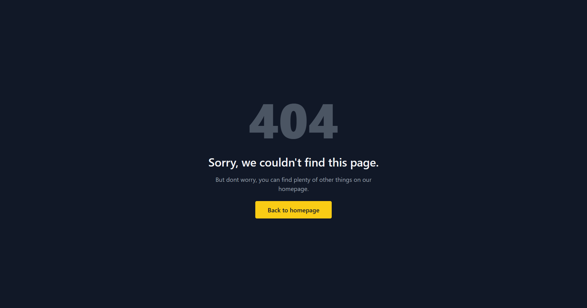

# Example Page using SolarisUI Components
Example Page using SolarisUI Components

# Header
The header contains several links:
- Link1 (https://...)
- Link2 (https://...)
- Link3 (https://...)

```ts
import * as sui from  "@sujalchoudhari/solaris-ui";
const atom = new sui.Atom(sui.Atomizer.getTemplate("header"), {
    links:[
        {
            title: "Link1",
            link: "https://..."
        },
        {
            title: "Link2",
            link: "https://..."
        },
        {
            title: "Link3",
            link: "https://..."
        }
    ]
} as HeaderProps);

page.children[1].addChildren(sui.Atomizer.buildComponentTreeFromAtom(atom));

sui.SolarisUI.buildProject("Components", [page]);
```

- Error: This feature displays an error message with a link to a URL. It uses the `error` template and the `ErrorProps` data.
- FAQ: This feature displays frequently asked questions with their corresponding answers. It uses the `faq` template and the `FAQProps` data.
- Feature: This feature displays a set of features with their corresponding descriptions and an image. It uses the `feature` template and the `FeatureProps` data.
- Footerbig: This feature displays a large footer with multiple columns, each containing rows of links. It uses the `footerbig` template and the `FooterBigProps` data.
- Footer: This feature displays a footer with a background image, links, and social media icons. It uses the `footer` template and the `FooterProps` data.
- Gallery: This feature displays a gallery of images, some of which are larger than others. It uses the `gallery` template and the `GalleryProps` data.
- Header: This feature displays a header with a logo, a tagline, and links. It uses the `header` template and the `HeaderProps` data.
- There are numerous other templates that can be used. Explore the templates folder inside the project folder to see all the templates.

Each feature is a separate component that can be added to a web page using the `solarisUI` library. The code examples in the test block demonstrate how to create each feature using the appropriate template and data.




> *We are using mambaUI for this theme*